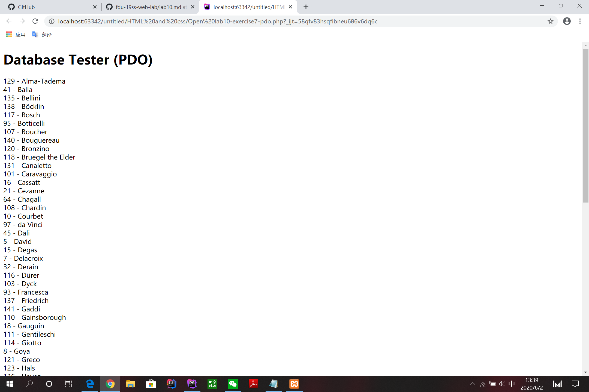
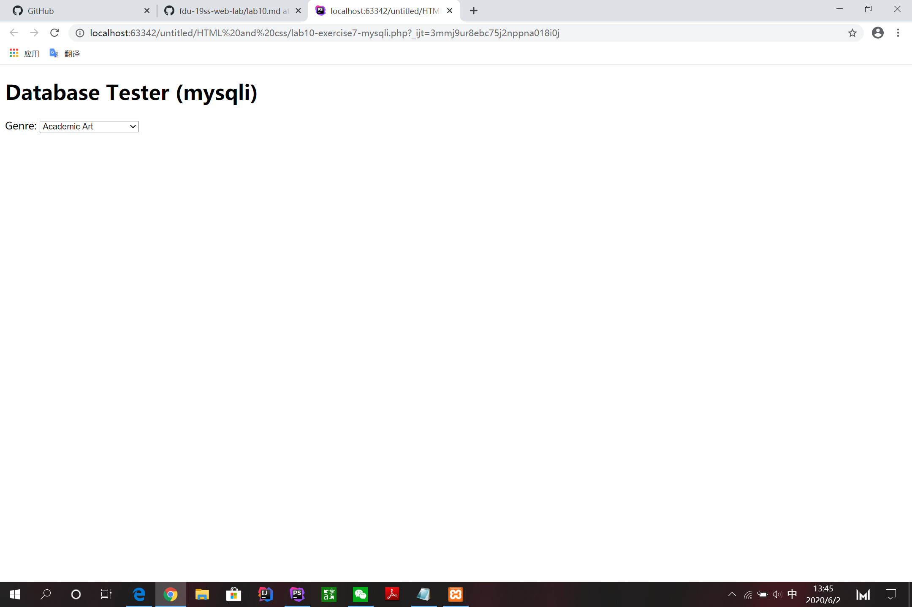

lab10
------------
在练习7中，运用了两种连接数据库的方法。在第一种方法中，PDO::ATTR_ERRMODE的含义是持续性连接，PDO::ERRMODE_EXCEPTION是指产生致命错误，PDOException。$sql = "select * from Artists order by LastName"是让数据库执行的语句，$result = $pdo->query($sql)是让此数据库执行的结果。后面的while循环就是，不断的输出序号-姓+换行，$pdo = null是指连接断开。在第二种中，mysqli_connect(DBHOST, DBUSER, DBPASS, DBNAME)是属于mysql数据库自己的连接方式。后面if语句是为了判断数据库是否连接成功。之后与PDO相似，不过在while里略有不同，直接通过php输出html。再释放内存，断开连接。
  
      
outputAritists先通过PDO连接数据库，在循环里面输出html语句，在这语句中设立了一个a的链接，在转到此链接的同时，向它传递了艺术家的id与类别，在此之后，通过if语句确认$_GET['id']的存在并$_GET['id']等于这一行的艺术家ID，是的话输出active。这一个function用来输出艺术家。outputPaintings通过不停的循环输出单张图片，这一个function是用来输出上一个function艺术家所对应的图片。outputSinglePainting就是上一个function中用来输出单张图片的方法。在这一个function全程都通过echo输出html语句。    
     
DriverManager：用于管理JDBC驱动的服务类。主要功能是获取Connection对象。Connection：代表数据库连接对象，每个Connection代表一个物理连接会话。Statement：用于执行SQL语句的工具接口。PrepareStatement：为Statement的子接口，可预编译SQL 语句，常用语执行多条结构相同，仅值不同的SQL 语句。PreparedStatement预编译SQL语句，性能更好，执行更快。无须“拼接”SQL 语句，编程更简单。可以防止SQL 注入（如将输入的true当成直接量，导致判断直接通过，从而降低了安全性），安全性更好。